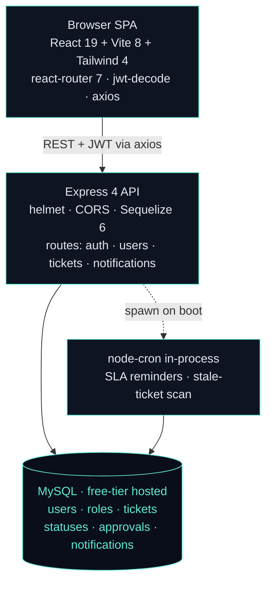
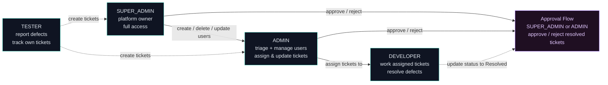
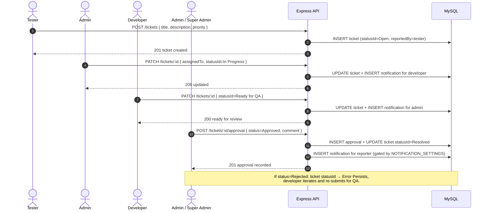
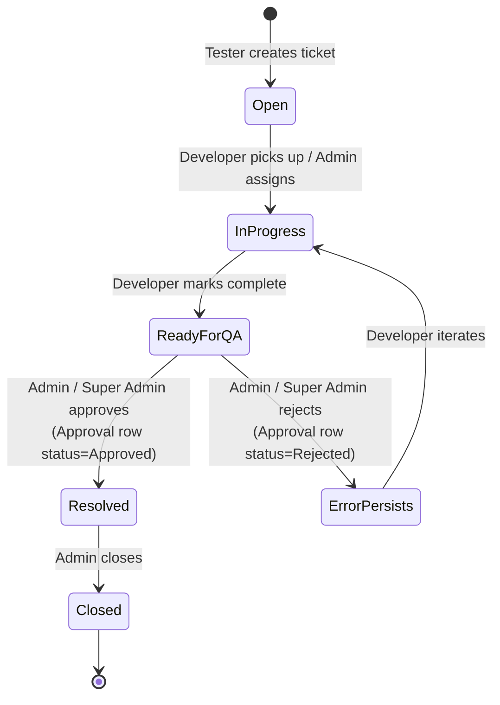
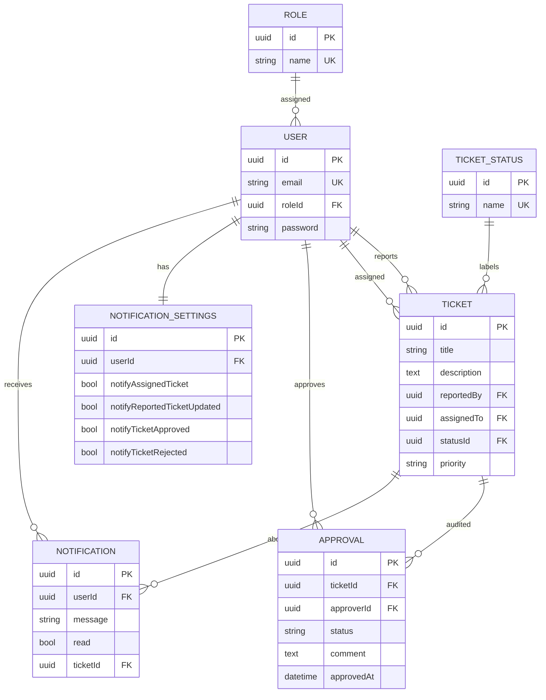

# Service Ticket System

> Internal IT/QA ticketing platform with a built-in approval workflow — testers report defects, developers fix them, admins triage, and approvers sign off before tickets close.

Service Ticket System is a four-role full-stack ticketing application with a real workflow shape: tester-reported defects flow through six lifecycle statuses with per-ticket approve/reject decisions, granular per-user notification preferences, and a node-cron SLA housekeeping job running in the same process as the API. Frontend is a React 19 SPA on Vercel; backend is a single Express 4 process on Render backed by a free-tier MySQL database.

---

## Live Demo

- **Live app:** https://service-ticket-system-frontend.vercel.app/login
- **Backend:** Render Web Service (`REST API` on port 3000)
- **Try it:** Log in with the seeded demo credentials (SUPER_ADMIN, ADMIN, TESTER, or DEVELOPER) — four roles, live approval workflows.

> Render Web Service sleeps after 15 minutes of inactivity. The first request may take 10–20 seconds to wake the dyno.

---

## Table of Contents

1. [What It Does](#what-it-does)
2. [Architecture](#architecture)
3. [Role Hierarchy & Permissions](#role-hierarchy--permissions)
4. [Ticket Lifecycle](#ticket-lifecycle)
5. [Tech Stack](#tech-stack)
6. [Database Design](#database-design)
7. [Repository Layout](#repository-layout)
8. [Repos](#repos)
9. [API Reference](#api-reference)
10. [Security](#security)
11. [Deployment & Environment Variables](#deployment--environment-variables)
12. [Cost Breakdown](#cost-breakdown)
13. [Local Development](#local-development)
14. [Author](#author)

---

## What It Does

- **Four-role access control** — `SUPER_ADMIN`, `ADMIN`, `TESTER`, `DEVELOPER`, each with distinct capabilities enforced server-side by `permissions.middleware.ts`.
- **Six ticket statuses** — `Open → In Progress → Ready for QA → Resolved / Error Persists → Closed`. Tester reports a defect; developer moves it through the workflow; admin/SuperAdmin approves (→ `Resolved`) or rejects (→ `Error Persists` for rework); admin eventually closes the ticket.
- **Per-ticket approval audit** — every approve/reject decision is a separate `APPROVAL` row with approver id, status, comment, and timestamp. Multiple decisions over a ticket's lifetime are preserved — full audit trail.
- **Notification preferences** — every user has a 1:1 `NOTIFICATION_SETTINGS` row (auto-created on user creation, defaults all true) covering assigned-ticket, ticket-updated, approved, and rejected events.
- **In-process SLA cron** — `node-cron` fires inside the same Express process; no separate worker service. Scans for stale/overdue tickets and emits notifications on schedule.
- **Auto-seed on boot** — on startup, the server idempotently seeds roles + ticket statuses + demo users (gated by `SEED_ON_BOOT` env var). No manual migration step for fresh deploys.
- **CORS allow-list** — hardcoded to the Vercel frontend URL and localhost dev origins; overridable via `CORS_ORIGINS` env for custom deployments.
- **Rate limiting** — `globalLimiter` on all routes, `loginLimiter` tightened on `/auth`.
- **Health probe** — `GET /health` returns `{ status: "UP", service, timestamp }` — used by Render uptime checks and the System Pulse companion project.
- **Profile self-service** — users change their own password from the Profile page.

---

## Architecture



### Notable architectural choices

- **Single Express process, no queue.** `helmet + cors + express.json + rate-limit → connectDB() → defineAssociations() → auto-seed → initCronJobs() → listen`. Everything boots in one process on Render's free tier.
- **node-cron co-located with the API** saves an entire worker service. The trade-off is that horizontal scaling requires leader-election; at portfolio scale (single dyno) it is strictly better.
- **Modular DDD-ish layout** — each domain (`tickets`, `users`, `notifications`) has its own `controllers / services / repositories / dtos / models / routes`. No cross-module imports beyond the associations file.
- **Snake_case DB columns mapped to camelCase model attributes** via Sequelize `field:` — clean SQL audit trail, idiomatic TypeScript code.
- **Auto-seed on boot** (`SEED_ON_BOOT=true`) — idempotent role + status + demo user seeding runs every start, making fresh Render deploys zero-manual-step.
- **bcryptjs over bcrypt** — pure JS, no native build step; deploys cleanly to Render free tier and any serverless platform.

---

## Role Hierarchy & Permissions



| Role | Created by | Can create tickets | Can update tickets | Can approve/reject | Can manage users |
|------|------------|-------------------|-------------------|-------------------|-----------------|
| `SUPER_ADMIN` | Seed script | Yes | Yes (any) | Yes | Yes |
| `ADMIN` | SUPER_ADMIN | Yes | Yes (any) | Yes | Yes (non-super) |
| `DEVELOPER` | SUPER_ADMIN / ADMIN | No | Own assigned | No | No |
| `TESTER` | SUPER_ADMIN / ADMIN | Yes | Own reported | No | No |

Permissions are enforced by `permissions.middleware.ts` and `role.utils.ts` — every route declares its minimum required role or specific action guard.

---

## Ticket Lifecycle



### Status state machine



> Note: `Approved` and `Rejected` are values on the `APPROVAL` row, not ticket statuses. The ticket itself transitions to `Resolved` (on approve) or `Error Persists` (on reject) — see `src/modules/tickets/services/approval.service.ts`.

---

## Tech Stack

### Backend

| Layer | Technology | Why |
|-------|-----------|-----|
| Runtime | Node.js + TypeScript 5 | Typed, modern Node LTS |
| Framework | **Express 4** | Lightweight, broad ecosystem |
| ORM | **Sequelize 6** + mysql2 | Full-featured ORM, association DSL, migrations |
| Database | **MySQL** | Broader free-tier availability than Postgres |
| Auth | JWT (`jsonwebtoken`) | Stateless, no session store |
| Password | **bcryptjs** | Pure JS, no native build step |
| Validation | **Yup** | Schema-first, composable |
| Scheduler | **node-cron** | In-process cron; no extra service |
| Notifications | In-app only (DB rows) | `NOTIFICATION` and `NOTIFICATION_SETTINGS` tables — no email layer wired up |
| Security | helmet · cors · rate-limit | CORS allow-list, security headers, per-route limiters |
| Dev | nodemon · ts-node · typescript 5 | Hot reload, no build step in dev |

### Frontend

| Layer | Technology | Why |
|-------|-----------|-----|
| Framework | **React 19** + TypeScript 5 | Latest React, typed props |
| Build | **Vite 8** | Sub-second HMR, fast CI builds |
| Styling | **Tailwind CSS 4** | Utility-first, latest engine |
| Routing | react-router-dom 7 | Nested layouts, protected routes |
| HTTP | **axios** | Interceptors for JWT injection |
| Auth | jwt-decode | Token inspection client-side |
| Icons | lucide-react | Consistent icon set |
| Linting | ESLint 9 + typescript-eslint | Strict type-aware lint |
| Hosting | **Vercel** | Auto-deploy from main, global CDN, free SSL |

---

## Database Design

Seven Sequelize models with UUID v4 primary keys throughout. DB columns are snake_case; model attributes are camelCase, mapped via Sequelize `field:` — clean SQL audit trail, idiomatic JS code.



### Table details

#### `tickets`

| Column | Type | Notes |
|--------|------|-------|
| `id` | UUID (PK) | v4 |
| `title` | VARCHAR | |
| `description` | TEXT | |
| `reported_by` | UUID (FK → users.id) | |
| `assigned_to` | UUID (FK → users.id) | nullable |
| `status_id` | UUID (FK → ticket_statuses.id) | |
| `priority` | VARCHAR | `LOW / MEDIUM / HIGH / CRITICAL` |

#### `approvals`

Per-decision audit row — multiple approvals over a ticket's lifetime are preserved.

| Column | Type | Notes |
|--------|------|-------|
| `id` | UUID (PK) | |
| `ticket_id` | UUID (FK) | |
| `approver_id` | UUID (FK) | |
| `status` | ENUM | `Approved / Rejected` |
| `comment` | TEXT | becomes part of audit trail |

#### `notification_settings`

1:1 with users. Defaults all `true` — auto-created for new users.

| Column | Type |
|--------|------|
| `user_id` | UUID (FK) |
| `notify_assigned_ticket` | BOOLEAN |
| `notify_reported_ticket_updated` | BOOLEAN |
| `notify_ticket_approved` | BOOLEAN |
| `notify_ticket_rejected` | BOOLEAN |

**Notable design choices:**

- **UUID v4 everywhere** — no sequential IDs leaking row counts or enabling enumeration attacks.
- **`TICKET_STATUS` as a reference table** — statuses are seeded rows, not a VARCHAR enum. Adding a status is a row insert, not a schema change.
- **`APPROVAL` as an immutable audit log** — each approve/reject is a new row; the full history of decisions is always queryable.
- **`NOTIFICATION_SETTINGS` auto-created** on user insert by `notification-setting.service.ts` — users always have preferences; no null checks needed.

---

## Repository Layout

```
service-ticket-system/           ← this repo (backend)
├── package.json                 # Express 4, Sequelize 6, node-cron, bcryptjs, Yup
├── tsconfig.json
└── src/
    ├── server.ts                # Entry: boot → connectDB → defineAssociations → seed → cron → listen
    ├── associations/
    │   └── associations.ts      # All Sequelize hasMany / belongsTo wired here
    ├── config/
    │   ├── db.ts                # Sequelize instance + connectDB()
    │   ├── roles.ts             # Role name constants
    │   └── statuses.ts          # Ticket status name constants
    ├── middlewares/
    │   ├── auth.middleware.ts       # JWT verify → req.user
    │   ├── permissions.middleware.ts # Role + action guards
    │   ├── rate-limit.middleware.ts  # globalLimiter + loginLimiter
    │   ├── role.utils.ts            # hasRole, isAtLeast helpers
    │   ├── security-headers.middleware.ts
    │   └── validator.middleware.ts  # Yup schema runner
    ├── modules/
    │   ├── tickets/
    │   │   ├── controllers/     # create, list, get, update, approval, fetch-status
    │   │   ├── cron/
    │   │   │   └── ticket.cron.ts  # SLA reminders + stale-ticket scan
    │   │   ├── dtos/            # create-ticket, update-ticket, create-approval, response shapes
    │   │   ├── models/          # Ticket, TicketStatus, Approval (Sequelize models)
    │   │   ├── repositories/    # ticket, ticket-status, approval
    │   │   ├── routes/
    │   │   │   └── ticket.routes.ts
    │   │   └── services/
    │   │       ├── ticket.service.ts    # Full CRUD + status transitions + notifications
    │   │       └── approval.service.ts  # Approve/reject logic + audit row
    │   ├── users/
    │   │   ├── controllers/     # auth, login, create, list, get, update, delete,
    │   │   │                    # notification settings (get + update), fetch-role
    │   │   ├── dtos/
    │   │   ├── models/          # User, Role, NotificationSettings
    │   │   ├── repositories/    # user, role, notification-setting
    │   │   ├── routes/          # auth.routes, user.routes, notification-settings.routes
    │   │   └── services/        # auth, user, notification-setting
    │   └── notifications/
    │       ├── controllers/     # list-notifications
    │       ├── dtos/
    │       ├── models/          # Notification
    │       ├── repositories/    # notification
    │       ├── routes/
    │       └── services/        # notification.service
    ├── scripts/
    │   ├── seed-roles.ts        # Idempotent role seeding
    │   ├── seed-ticket-status.ts
    │   ├── seed-users.ts        # Demo accounts for all four roles
    │   └── sync-db.ts           # Sequelize sync (force: false)
    └── utils/
        ├── notification.validation.ts
        ├── ticket.validation.ts
        └── user.validation.ts

service-ticket-system-frontend/  ← companion repo (see Repos section)
```

---

## Repos

| Repo | Stack | Link |
|------|-------|------|
| **service-ticket-system** (this repo) | REST API · Express 4 + Sequelize + MySQL + node-cron | https://github.com/Asciente-rks/service-ticket-system |
| **service-ticket-system-frontend** | Web SPA · React 19 + Vite 8 + Tailwind 4 | https://github.com/Asciente-rks/service-ticket-system-frontend |

The frontend is a separate repo deployed independently to Vercel. It consumes this API via `axios` with a `VITE_API_URL` env var pointing at the Render service URL.

---

## API Reference

### Auth

| Method | Path | Auth | Purpose |
|--------|------|------|---------|
| POST | `/auth/login` | none | Email + password → JWT |

> Accounts are created via `POST /users` (admin-gated) or seeded on boot. There is **no** public `/auth/register` endpoint.

### Users

| Method | Path | Auth | Purpose |
|--------|------|------|---------|
| GET | `/users` | session + role check (ADMIN / DEVELOPER / TESTER) | List users |
| GET | `/users/:id` | session + owner-or-admin | Get a single user |
| POST | `/users` | session + admin | Create user with role assignment |
| PUT | `/users/:id` | session + owner-or-admin + role-hierarchy check | Update user details |
| DELETE | `/users/:id` | session + owner-or-admin + role-hierarchy check | Hard delete user |
| GET | `/users/roles` | none | List all roles (lookup table) |
| GET | `/users/notification-settings` | session | Get the **current user's** notification preferences |
| PATCH | `/users/notification-settings` | session | Update the current user's notification preferences |

### Tickets

| Method | Path | Auth | Purpose |
|--------|------|------|---------|
| GET | `/tickets/statuses` | none | List all ticket statuses (no auth — reference data) |
| GET | `/tickets` | session | List tickets (role-filtered server-side) |
| GET | `/tickets/:id` | session | Ticket detail |
| POST | `/tickets` | session + role check (SUPER_ADMIN / ADMIN / TESTER) | Create a ticket |
| PATCH | `/tickets/:id` | session | Update status, assignee, details (deeper checks live in the service layer) |
| POST | `/tickets/:id/approval` | session + role check (SUPER_ADMIN / ADMIN) | Approve (→ Resolved) or reject (→ Error Persists) a Ready-for-QA ticket |

### Notifications

| Method | Path | Auth | Purpose |
|--------|------|------|---------|
| GET | `/notifications` | session | List notifications for the current user |

---

## Security

| Layer | Defense |
|-------|---------|
| Password storage | bcryptjs hash + compare |
| JWT | Short-lived signed tokens; verified on every protected route by `auth.middleware.ts` |
| Rate limiting | `globalLimiter` on all routes; `loginLimiter` (tighter) on `/auth` |
| CORS | Explicit allow-list: Vercel frontend URL + localhost dev origins; overridable via env |
| Security headers | helmet (CSP disabled for SPA flexibility, CORP set to `cross-origin`) + custom `security-headers.middleware.ts` |
| Input validation | Yup schemas in `utils/*.validation.ts`, run by `validator.middleware.ts` before controllers |
| Role enforcement | `permissions.middleware.ts` checks `req.user.role` against declared minimum per route |
| UUID PKs | No sequential IDs — prevents row-count leakage and enumeration |
| Body size cap | `express.json({ limit: "1mb" })` |

---

## Deployment & Environment Variables

The backend is deployed as a **Render Web Service**. On boot, `server.ts` auto-seeds roles + ticket statuses + demo users — no manual migration step required.

### Required env vars

| Variable | Purpose |
|----------|---------|
| `DB_HOST` | MySQL host (e.g., Aiven or FreeSQLDatabase hostname) |
| `DB_PORT` | MySQL port (default `3306`) |
| `DB_NAME` | Database name |
| `DB_USER` | MySQL user |
| `DB_PASSWORD` | MySQL password |
| `JWT_SECRET` | Secret for signing JWTs |

### Optional env vars (defaults shown)

| Variable | Default | Notes |
|----------|---------|-------|
| `PORT` | `3000` | HTTP port |
| `NODE_ENV` | `development` | Set `production` on Render |
| `CORS_ORIGINS` | (Vercel frontend + localhost) | Comma-separated allow-list override |
| `SEED_ON_BOOT` | `true` | Set `false` to skip auto-seed |
| `SERVICE_NAME` | `service-ticket-system` | Appears in `/health` response |

### Seed-specific env vars (for demo data)

| Variable | Purpose |
|----------|---------|
| `SEED_ADMIN_EMAIL` / `SEED_ADMIN_PASSWORD` | Demo ADMIN account |
| `SEED_TESTER_EMAIL` / `SEED_TESTER_PASSWORD` | Demo TESTER account |
| `SEED_DEVELOPER_EMAIL` / `SEED_DEVELOPER_PASSWORD` | Demo DEVELOPER account |

Seed scripts are also runnable standalone:

```bash
npm run seed:roles      # idempotent role rows
npm run seed:status     # idempotent ticket status rows
npm run seed:users      # demo accounts for all four roles
npm run seed:all        # roles + statuses + users in sequence
npm run db:reset        # sync + seed:all
```

---

## Cost Breakdown

Designed for **$0/month** — every layer runs on a free tier with no expiry.

| Service | Free tier | We use | Headroom |
|---------|-----------|--------|----------|
| Render Web Service | 750 hours/mo, sleeps after 15 min | Single always-on dyno | Within limits |
| MySQL (Aiven / FreeSQLDatabase) | 5 GB / 1 GB depending on provider | < 50 MB | 95%+ |
| Vercel Hobby (frontend) | 100 GB bandwidth, unlimited deploys | < 500 MB/mo | 99.5% |
| GitHub Actions (public repo) | Unlimited minutes | n/a (Vercel auto-deploys) | Unlimited |

**Monthly total: $0/month**

**Rationale for notable choices:**

- **MySQL over PostgreSQL** — broader free-tier availability (Aiven, FreeSQLDatabase, Filess.io).
- **bcryptjs over bcrypt** — pure JS, no native build step; deploys cleanly to Render free tier.
- **Vercel for the SPA** — global CDN + free SSL + automatic deploys + zero-config Vite detection.
- **node-cron in-process** — saves an entire worker service; trade-off is horizontal-scaling requires leader election.

---

## Local Development

```bash
# 1. Clone and install
git clone https://github.com/Asciente-rks/service-ticket-system.git
cd service-ticket-system
npm install

# 2. Configure environment
cp .env.example .env        # fill in DB_* and JWT_SECRET

# 3. Sync schema + seed demo data
npm run db:reset            # sequelize sync + roles + statuses + demo users

# 4. Start dev server (ts-node + nodemon hot reload)
npm run dev                 # listens on :3000

# 5. Frontend (separate repo)
git clone https://github.com/Asciente-rks/service-ticket-system-frontend.git
cd service-ticket-system-frontend
npm install
# set VITE_API_URL=http://localhost:3000 in .env.local
npm run dev                 # Vite HMR at :5173
```

For a fresh local MySQL instance, set `DB_HOST=127.0.0.1`, create the database, and `npm run db:reset` will handle the rest.

---

## Author

**Ralph Kenneth Sonio** — Cloud-Native Backend & QA Engineer
[Portfolio](https://asciente-portfolio.vercel.app) · [GitHub](https://github.com/Asciente-rks)
