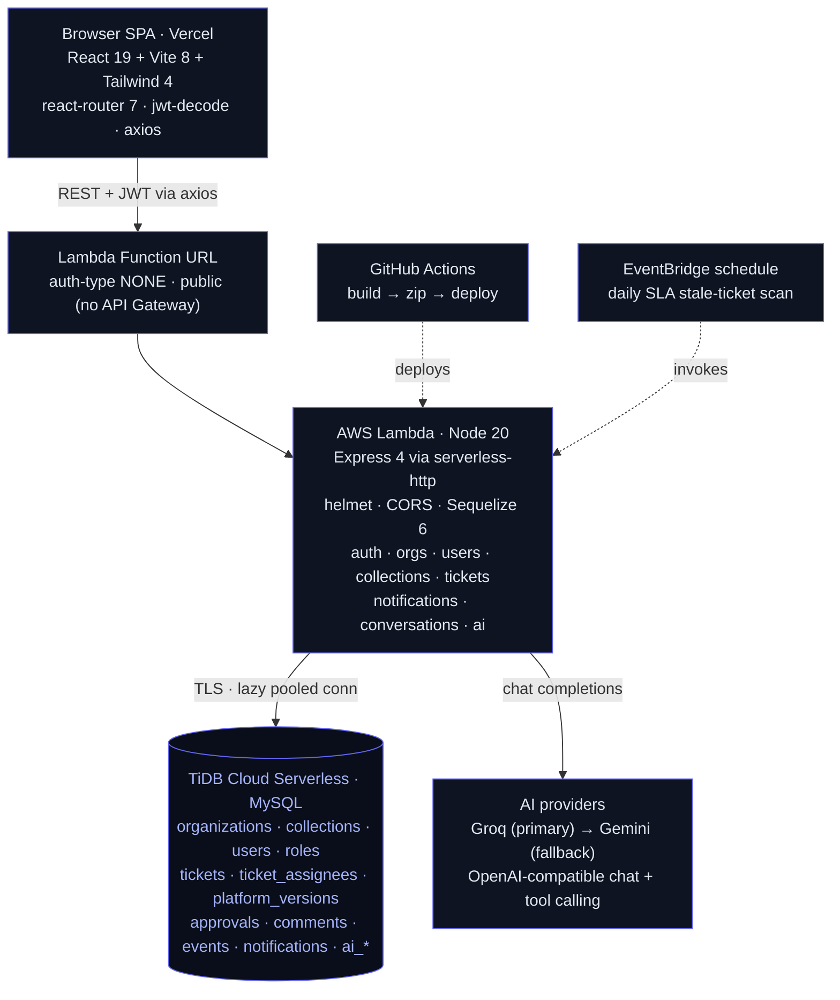
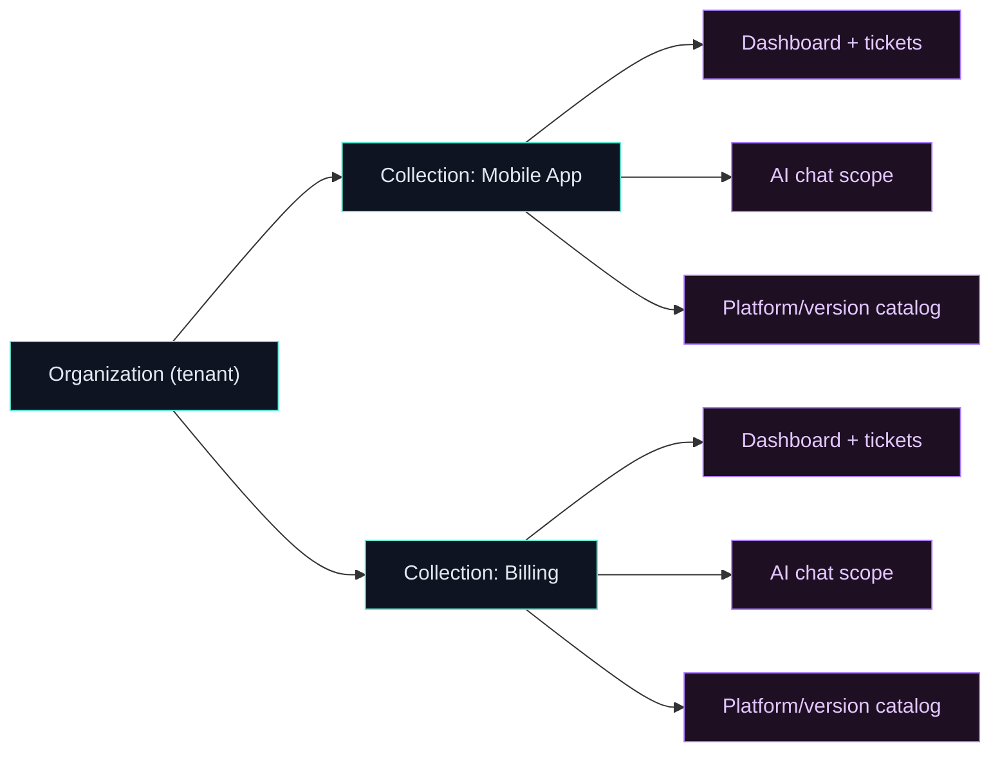
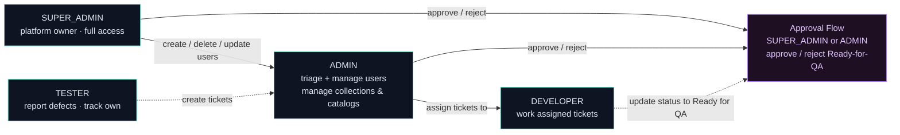
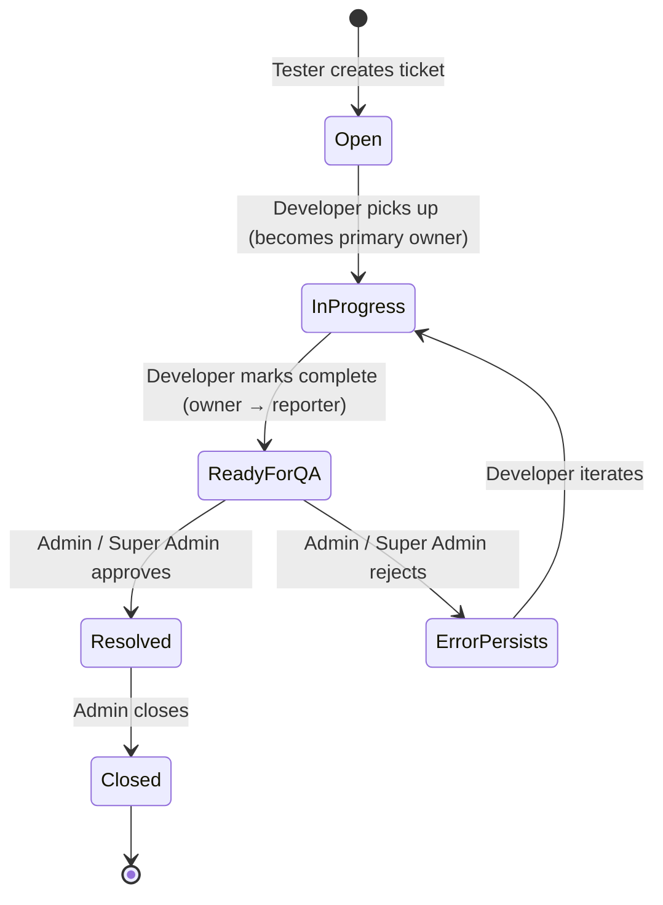
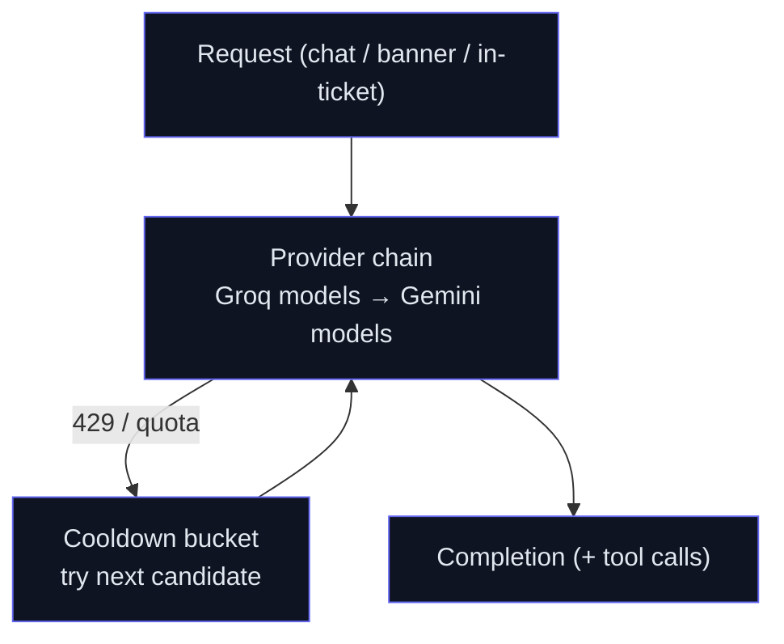
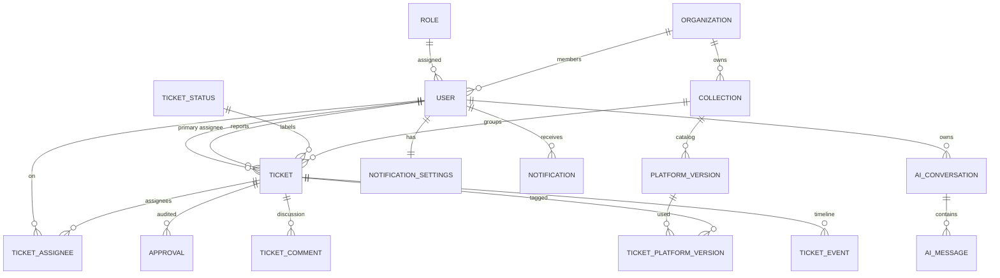

# NexusTrack — Backend (service-ticket-system)

> Multi-tenant QA/defect tracking API. Organizations split work into **Collections** (project spaces); inside each, testers report defects, developers fix them, admins triage, approvers sign off — with **multiple assignees**, **per-collection platform/version tagging**, threaded discussion, teammate DMs, and a built-in **AI assistant** (conversational queries, in-ticket Q&A, and duplicate detection).

NexusTrack is a **multi-tenant SaaS**: every organization is an isolated workspace of users, collections, tickets, conversations, and notifications. Sign-up is a self-service **email-OTP** flow (register → verify code → set password); a user then **creates** an organization (becoming its SuperAdmin) or **joins** one via invite code. Work is organized into **Collections** — one per system/product — and each collection is its own dashboard, AI chat scope, and platform/version catalog. The frontend is a React 19 SPA on Vercel; this backend is an **Express 4 app running on AWS Lambda** (exposed via a Lambda **Function URL**, no API Gateway), deployed by **GitHub Actions**, backed by **TiDB Cloud Serverless** (MySQL-compatible). The AI layer runs on **Groq** (primary) with **Google Gemini** fallback.

---

## Live Demo

- **Live app:** https://service-ticket-system-frontend.vercel.app/login
- **Backend:** AWS Lambda (Function URL) — serverless REST API, deployed via GitHub Actions
- **Try it:** log in with the seeded demo accounts (all in the **Demo Organization**, invite code `DEMO-CREW`) or register a new account and create your own organization.

> Cold starts: after a period of inactivity the first request may take a couple of seconds while the Lambda container and DB connection warm up. Subsequent requests are fast.

### Demo accounts

| Role | Email | Password |
|------|-------|----------|
| SuperAdmin | `superadmin@test.com` | `Password123!` |
| Admin | `admin@test.com` | `Password123!` |
| Developer | `developer@test.com` | `Password123!` |
| Tester | `tester@test.com` | `Password123!` |

---

## Table of Contents

1. [What It Does](#what-it-does)
2. [Architecture](#architecture)
3. [Collections — the workspace model](#collections--the-workspace-model)
4. [Role Hierarchy & Permissions](#role-hierarchy--permissions)
5. [Ticket Lifecycle & Assignment](#ticket-lifecycle--assignment)
6. [AI Layer](#ai-layer)
7. [Tech Stack](#tech-stack)
8. [Database Design](#database-design)
9. [Repository Layout](#repository-layout)
10. [API Reference](#api-reference)
11. [Security](#security)
12. [Deployment & Environment Variables](#deployment--environment-variables)
13. [Cost Breakdown](#cost-breakdown)
14. [Local Development](#local-development)
15. [Repos](#repos)
16. [Author](#author)

---

## What It Does

- **Multi-tenant workspaces** — every read/write is scoped to the caller's `organizationId`; organizations never see each other's data.
- **Collections (project spaces)** — tickets are grouped into Collections (e.g. "Mobile App", "Billing"). Each collection has its own dashboard, AI chat history, and platform/version catalog. Collections are admin-managed; the default ("General") is auto-created and adopts any legacy orphan tickets.
- **Four-role access control** — `SUPER_ADMIN`, `ADMIN`, `TESTER`, `DEVELOPER`, enforced server-side by `permissions.middleware.ts` and per-assignee role rules in the ticket service.
- **Six-status lifecycle** — `Open → In Progress → Ready for QA → Error Persists → Resolved → Closed`, with **status-driven auto-reassignment** (In Progress → the developer who picks it up; Ready for QA → back to the reporter).
- **Multiple assignees** — a ticket can have several assignees (join table `ticket_assignees`); the `assigned_to` column is retained as the **primary/lifecycle owner** that drives reassignment and notifications.
- **Per-collection platform/version tagging** — admins curate a `platform_versions` catalog per collection (e.g. "Web · 1.1.0"); each ticket can be tagged with one or more (join table `ticket_platform_versions`).
- **Approval audit** — every approve/reject is an immutable `approvals` row (approver, status, comment, timestamp).
- **Threaded comments + activity timeline** — `ticket_comments` (nested replies) and an immutable `ticket_events` timeline (reported / assigned / reassigned / status_changed / approved / rejected).
- **Direct messaging** — 1:1 teammate conversations (`conversations` + `messages`).
- **Notifications + per-user preferences** — in-app `notifications` gated by a 1:1 `notification_settings` row.
- **AI assistant** — org/collection-scoped conversational assistant with read-only function-calling tools, a stateless in-ticket assistant, and **deterministic duplicate detection** surfaced as a dashboard banner with an interactive review flow.
- **Runtime self-provisioning** — feature tables are created idempotently on first request, so a code deploy needs no manual migration step (a hand-written migrate workflow mirrors the same schema).
- **Health probe** — `GET /health` returns `{ status: "UP", service, timestamp }` and never touches the DB.

---

## Architecture


```mermaid
graph TB
    Browser["Browser SPA · Vercel<br/>React 19 + Vite 8 + Tailwind 4<br/>react-router 7 · jwt-decode · axios"]
    URL["Lambda Function URL<br/>auth-type NONE · public (no API Gateway)"]
    Lambda["AWS Lambda · Node 20<br/>Express 4 via serverless-http<br/>helmet · CORS · Sequelize 6<br/>auth · orgs · users · collections · tickets<br/>notifications · conversations · ai"]
    AI["AI providers<br/>Groq (primary) → Gemini (fallback)<br/>OpenAI-compatible chat + tool calling"]
    TiDB[("TiDB Cloud Serverless · MySQL<br/>organizations · collections · users · roles<br/>tickets · ticket_assignees · platform_versions<br/>approvals · comments · events · notifications · ai_*")]
    Actions["GitHub Actions<br/>build → zip → deploy"]
    Cron["EventBridge schedule<br/>daily SLA stale-ticket scan"]

    Browser -->|REST + JWT via axios| URL
    URL --> Lambda
    Lambda -->|TLS · lazy pooled conn| TiDB
    Lambda -->|chat completions| AI
    Actions -.deploys.-> Lambda
    Cron -.invokes.-> Lambda

    classDef edge fill:#0f1422,stroke:#6366f1,color:#e2e8f0
    classDef store fill:#0a0e1a,stroke:#6366f1,color:#a5b4fc
    class Browser,URL,Lambda,AI,Actions,Cron edge
    class TiDB store
```

### Notable architectural choices

- **Express on Lambda, no always-on server.** The same Express app is wrapped with `serverless-http` and exposed through a Lambda Function URL. Cold starts only wire model associations (in-memory); Sequelize opens the DB connection lazily on the first query and reuses it across warm invocations, so `/health` never depends on the DB. No API Gateway, no per-request gateway cost.
- **Runtime schema self-provisioning.** Lightweight bootstrap guards (`ensureCollectionSchema`, `ensureTicketFeatureSchema`, `ensureAiTables`) run `CREATE TABLE IF NOT EXISTS` / additive `ALTER`s on first request, with one-time backfills (e.g. mirroring each ticket's single assignee into `ticket_assignees`). The same schema is mirrored in `scripts/migrate.ts`, run from a manual GitHub workflow. Production never runs a destructive `sync`.
- **Single-assignee column + join table.** `tickets.assigned_to` stays as the primary/lifecycle owner so status transitions, notifications and the timeline keep working unchanged, while `ticket_assignees` holds the full set. Platform/version follows the same primary-column-plus-join pattern.
- **Modular DDD-ish layout.** Each domain (`tickets`, `users`, `collections`, `notifications`, `conversations`, `ai`) owns its `controllers / services / repositories / dtos / models / routes`; cross-module wiring lives only in `associations/associations.ts`.
- **Multi-provider AI with failover.** A candidate chain (Groq models first, then Gemini) is walked per call; on a 429 / quota error the candidate is parked in a cooldown bucket and the next one — including the other provider — is tried automatically.
- **bcryptjs / mysql2 / serverless-http** — all pure JS, no native build step, so the same zip runs on the Amazon Linux Lambda runtime.

---

## Collections — the workspace model


```mermaid
flowchart LR
    org["Organization (tenant)"] --> c1["Collection: Mobile App"]
    org --> c2["Collection: Billing"]
    c1 --> b1["Dashboard + tickets"]
    c1 --> a1["AI chat scope"]
    c1 --> p1["Platform/version catalog"]
    c2 --> b2["Dashboard + tickets"]
    c2 --> a2["AI chat scope"]
    c2 --> p2["Platform/version catalog"]

    classDef tier fill:#0f1422,stroke:#5eead4,color:#e2e8f0
    classDef flow fill:#1f0f22,stroke:#a978ff,color:#e2c8ff
    class org,c1,c2 tier
    class b1,a1,p1,b2,a2,p2 flow
```

- A new ticket belongs to the collection whose dashboard it was created from (falling back to the org's default collection).
- Deleting a collection moves its tickets to the oldest remaining collection — the last collection can't be deleted.
- AI chats are scoped per collection (`ai_conversations.collection_id`); a collection's chat history never appears in another's.

---

## Role Hierarchy & Permissions


```mermaid
flowchart LR
    super["SUPER_ADMIN<br/>platform owner · full access"]
    admin["ADMIN<br/>triage + manage users<br/>manage collections & catalogs"]
    dev["DEVELOPER<br/>work assigned tickets"]
    tester["TESTER<br/>report defects · track own"]
    approval["Approval Flow<br/>SUPER_ADMIN or ADMIN<br/>approve / reject Ready-for-QA"]

    super -->|create / delete / update users| admin
    super -->|approve / reject| approval
    admin -->|assign tickets to| dev
    admin -->|approve / reject| approval
    tester -.create tickets.-> admin
    dev -.update status to Ready for QA.-> approval

    classDef tier fill:#0f1422,stroke:#5eead4,color:#e2e8f0
    classDef flow fill:#1f0f22,stroke:#a978ff,color:#e2c8ff
    class super,admin,dev,tester tier
    class approval flow
```

| Role | Created by | Create tickets | Update tickets | Approve/reject | Manage users | Manage collections / catalogs |
|------|-----------|----------------|----------------|----------------|--------------|-------------------------------|
| `SUPER_ADMIN` | seed | Yes | Any | Yes | Yes | Yes |
| `ADMIN` | SUPER_ADMIN | Yes | Any | Yes | Yes (non-super) | Yes |
| `DEVELOPER` | SUPER_ADMIN / ADMIN | Yes | Own assigned | No | No | No |
| `TESTER` | SUPER_ADMIN / ADMIN | Yes | Own reported | No | No | No |

Assignment is gated per assignee: tickets can't be assigned to SuperAdmins, and Admins/Testers/Developers can only assign within their permitted set. Assigning to oneself is always allowed.

---

## Ticket Lifecycle & Assignment


```mermaid
stateDiagram-v2
    [*] --> Open: Tester creates ticket
    Open --> InProgress: Developer picks up (becomes primary owner)
    InProgress --> ReadyForQA: Developer marks complete (owner → reporter)
    ReadyForQA --> Resolved: Admin / Super Admin approves
    ReadyForQA --> ErrorPersists: Admin / Super Admin rejects
    ErrorPersists --> InProgress: Developer iterates
    Resolved --> Closed: Admin closes
    Closed --> [*]
```

- **Multiple assignees:** `assigneeIds[]` on create/update sets the full roster; the first becomes the primary (`assigned_to`). Status transitions add the lifecycle owner (the actor on *In Progress*, the reporter on *Ready for QA*) to the set without removing others.
- **Audit & timeline:** approve/reject decisions are immutable `approvals` rows; assignment/status changes are written to `ticket_events`.
- `Approved` / `Rejected` are values on the approval row — the ticket itself moves to `Resolved` (approve) or `Error Persists` (reject). See `src/modules/tickets/services/approval.service.ts`.

---

## AI Layer

Three AI surfaces, all read-only and **organization-scoped**:

1. **Conversational assistant** (`/ai/conversations/:id/messages`) — a tool-calling agent loop (max 5 rounds) with read-only tools: `query_tickets`, `get_ticket_details`, `query_comments`, `query_activity`, `find_duplicate_tickets`, `list_collections`, `get_ticket_stats`, `list_team_members`. It references tickets as `[ticket:<id>|<title>]` tokens that the UI renders as clickable chips.
2. **In-ticket assistant** (`/ai/tickets/:ticketId/ask`) — stateless Q&A / summary about one ticket; the full ticket context is loaded server-side, so no tools are needed.
3. **Duplicate detection** (`/ai/duplicates`) — flags tickets that describe the same underlying issue, surfaced as a dashboard banner and an interactive "Verify with AI" review (open / delete / keep). Runs at **temperature 0** so the banner and the chat always agree; results are cached per org+collection (positive hits longer; empty results briefly, so the banner self-heals).


```mermaid
flowchart TB
    req["Request (chat / banner / in-ticket)"] --> chain["Provider chain<br/>Groq models → Gemini models"]
    chain -->|429 / quota| cool["Cooldown bucket<br/>try next candidate"]
    cool --> chain
    chain --> out["Completion (+ tool calls)"]
    classDef edge fill:#0f1422,stroke:#6366f1,color:#e2e8f0
    class req,chain,cool,out edge
```

Set `GROQ_API_KEY` and/or `GEMINI_API_KEY` to enable `/ai/*`; with both set, a single provider's rate limit never takes the AI features down.

---

## Tech Stack

| Layer | Technology |
|-------|-----------|
| Runtime | Node.js 20 + TypeScript 5 |
| Framework | Express 4 (+ `serverless-http` on Lambda) |
| ORM | Sequelize 6 + `mysql2` |
| Database | TiDB Cloud Serverless (MySQL-compatible) |
| Auth | JWT (`jsonwebtoken`) · bcryptjs |
| Validation | Yup (`validator.middleware.ts`) |
| AI | Groq + Google Gemini (OpenAI-compatible chat + tool calling), plain `fetch` |
| Security | helmet · cors allow-list · per-route rate limiting |
| CI/CD | GitHub Actions → AWS Lambda + Function URL; EventBridge for the SLA cron |
| Dev | nodemon · ts-node |

---

## Database Design

UUID v4 primary keys throughout. DB columns are snake_case; model attributes are camelCase (Sequelize `field:`).


```mermaid
erDiagram
    ORGANIZATION ||--o{ USER : members
    ORGANIZATION ||--o{ COLLECTION : owns
    COLLECTION ||--o{ TICKET : groups
    COLLECTION ||--o{ PLATFORM_VERSION : catalog
    ROLE ||--o{ USER : assigned
    TICKET_STATUS ||--o{ TICKET : labels
    USER ||--o{ TICKET : reports
    USER ||--o{ TICKET : "primary assignee"
    TICKET ||--o{ TICKET_ASSIGNEE : assignees
    USER ||--o{ TICKET_ASSIGNEE : on
    TICKET ||--o{ TICKET_PLATFORM_VERSION : tagged
    PLATFORM_VERSION ||--o{ TICKET_PLATFORM_VERSION : used
    TICKET ||--o{ APPROVAL : audited
    TICKET ||--o{ TICKET_COMMENT : discussion
    TICKET ||--o{ TICKET_EVENT : timeline
    USER ||--|| NOTIFICATION_SETTINGS : has
    USER ||--o{ NOTIFICATION : receives
    USER ||--o{ AI_CONVERSATION : owns
    AI_CONVERSATION ||--o{ AI_MESSAGE : contains
```

Key tables beyond the originals:

| Table | Purpose |
|-------|---------|
| `organizations` | Tenant root (name, slug, invite_code, owner_id) |
| `collections` | Project spaces within an org |
| `platform_versions` | Per-collection build catalog — unique `(collection_id, platform, version)` |
| `ticket_assignees` | Many-to-many assignees — unique `(ticket_id, user_id)` |
| `ticket_platform_versions` | Many-to-many ticket ↔ platform/version |
| `ticket_comments` | Threaded comments (`parent_id` for replies) |
| `ticket_events` | Immutable activity timeline |
| `conversations` / `messages` | 1:1 teammate direct messages |
| `ai_conversations` / `ai_messages` | Per-user AI chat threads (scoped per collection) + messages |
| `email_verifications` | OTP sign-up codes |

`tickets` carries `organization_id`, `collection_id`, `platform_version_id` (primary), `assigned_to` (primary owner), `reported_by`, `status_id`, `priority`, optional `jam_url`.

---

## Repository Layout

```
service-ticket-system/                 ← this repo (backend)
└── src/
    ├── server.ts                       # local entry: connectDB → defineAssociations → seed → cron → listen
    ├── lambda.ts                       # serverless-http handler (+ scheduled-event SLA job)
    ├── app.ts                          # express app: helmet, CORS allow-list, routers, /health
    ├── associations/associations.ts    # all Sequelize relations (incl. assignees & platform/version M:N)
    ├── config/                         # db.ts · roles.ts · statuses.ts
    ├── middlewares/                    # auth · permissions · rate-limit · validator · security-headers
    ├── modules/
    │   ├── tickets/                     # tickets, assignees, platform-version FK, comments, events, approvals, cron
    │   ├── collections/                 # collections + per-collection platform_versions (nested routes)
    │   ├── users/                       # auth (OTP), users, roles, notification-settings
    │   ├── notifications/               # in-app notifications
    │   ├── conversations/               # teammate direct messages
    │   ├── organizations/               # org create / join / me
    │   └── ai/                          # provider chain, chat agent loop, tools, duplicate detection, bootstrap
    ├── scripts/                         # migrate.ts (idempotent) + seed-roles / status / users
    └── utils/                           # Yup validation schemas, token, email
```

---

## API Reference

Base URL = the Lambda Function URL. All authenticated routes take `Authorization: Bearer <jwt>` and are tenant-scoped.

### Auth & Onboarding
| Method | Path | Auth | Purpose |
|--------|------|------|---------|
| POST | `/auth/register` | none | Start sign-up — sends a 6-digit OTP |
| POST | `/auth/verify-otp` | none | `{ email, code }` → short-lived registration token |
| POST | `/auth/set-password` | none | `{ registrationToken, name, password }` → account + JWT |
| POST | `/auth/login` | none | Email + password → JWT |

### Organizations
| Method | Path | Auth | Purpose |
|--------|------|------|---------|
| POST | `/organizations` | session | Create org (caller becomes SuperAdmin); re-issues JWT |
| POST | `/organizations/join` | session | Join via `{ inviteCode }`; re-issues JWT |
| GET | `/organizations/me` | session + org | Current org details |

### Collections & Platform/Versions
| Method | Path | Auth | Purpose |
|--------|------|------|---------|
| GET | `/collections` | session + org | List collections with ticket counts |
| POST | `/collections` | admin | Create a collection |
| PATCH | `/collections/:id` | admin | Rename / update a collection |
| DELETE | `/collections/:id` | admin | Delete (tickets move to default) |
| GET | `/collections/:collectionId/platform-versions` | session + org | List the catalog |
| POST | `/collections/:collectionId/platform-versions` | admin | Add a platform/version |
| PATCH | `/collections/:collectionId/platform-versions/:id` | admin | Edit |
| DELETE | `/collections/:collectionId/platform-versions/:id` | admin | Delete (detaches tickets) |

### Tickets
| Method | Path | Auth | Purpose |
|--------|------|------|---------|
| GET | `/tickets/statuses` | none | Reference data |
| GET | `/tickets` | session + org | List (collection-scoped, `Cache-Control: no-store`) |
| GET | `/tickets/:id` | session + org | Ticket detail (assignees + platform/versions) |
| POST | `/tickets` | session + org | Create with `assigneeIds[]` + `platformVersionIds[]` |
| PATCH | `/tickets/:id` | session + org | Update status / assignees / platform-versions / details |
| DELETE | `/tickets/:id` | session + org (admin or reporter) | Delete |
| POST | `/tickets/:id/approval` | SUPER_ADMIN / ADMIN | Approve (→ Resolved) / reject (→ Error Persists) |
| GET | `/tickets/:id/comments` | session + org | Threaded comments |
| POST | `/tickets/:id/comments` | session + org | Add a comment / reply |
| DELETE | `/tickets/:id/comments/:commentId` | author | Delete a comment |
| GET | `/tickets/:id/history` | session + org | Activity timeline |

### Notifications · Conversations
| Method | Path | Auth | Purpose |
|--------|------|------|---------|
| GET | `/notifications` | session + org | List |
| GET | `/notifications/unread-count` | session + org | `{ count }` |
| PATCH | `/notifications/:id/read` · `/notifications/read-all` | session + org | Mark read |
| GET/POST | `/conversations` · `/conversations/:id/messages` | session + org | Teammate DMs (polled for real-time) |
| GET | `/conversations/unread-count` | session + org | DM badge |

### Users
| Method | Path | Auth | Purpose |
|--------|------|------|---------|
| GET | `/users` | ADMIN / DEVELOPER / TESTER | List members (for assignee pickers) |
| POST | `/users` | admin | Create user with role |
| GET/PUT/DELETE | `/users/:id` | owner-or-admin + hierarchy | Read / update / delete |
| GET | `/users/roles` | none | Roles lookup |
| GET/PATCH | `/users/notification-settings` | session | Read / update preferences |
| GET/PATCH | `/users/me` | session | Profile self-service |

### AI
| Method | Path | Auth | Purpose |
|--------|------|------|---------|
| GET | `/ai/status` | session + org | `{ configured }` |
| GET | `/ai/duplicates` | session + org | Cached duplicate detection (dashboard banner) |
| GET/POST | `/ai/conversations` | session + org | List / create chat threads |
| GET | `/ai/conversations/:id/messages` | session + org | Thread messages (+ ticket refs, duplicate groups) |
| POST | `/ai/conversations/:id/messages` | session + org | Send a message; runs the tool-calling agent loop |
| PATCH/DELETE | `/ai/conversations/:id` | session + org | Rename / delete a thread |
| POST | `/ai/tickets/:ticketId/ask` | session + org | Stateless in-ticket assistant |

### Health
| Method | Path | Auth | Purpose |
|--------|------|------|---------|
| GET | `/health` | none | `{ status: "UP", service, timestamp }` — never touches the DB |

---

## Security

| Layer | Defense |
|-------|---------|
| Passwords | bcryptjs hash + compare |
| JWT | Signed, short-lived; verified on every protected route (`auth.middleware.ts`) |
| Tenant isolation | Every query scoped to `organizationId`; cross-org access returns 404 |
| Rate limiting | `globalLimiter` on all routes; tighter limiter on `/auth` and AI generation endpoints |
| CORS | Explicit allow-list (Vercel frontend + Vercel preview regex + localhost), overridable via `CORS_ORIGINS` |
| Headers | helmet + custom `security-headers.middleware.ts` |
| Validation | Yup schemas run before controllers |
| AI safety | Tools are read-only and org-scoped; the assistant cannot mutate data or cross tenants |
| UUID PKs | No sequential IDs — no enumeration / row-count leakage |
| Body cap | `express.json({ limit: "1mb" })` |

---

## Deployment & Environment Variables

CI/CD is **GitHub Actions** (`.github/workflows/deploy-backend.yml`): on every push to `main` it builds the TypeScript, packages a zip (`dist/` + production `node_modules`), and creates/updates the Lambda function and its public Function URL via the AWS CLI. A separate **Database (migrate / seed)** workflow runs the idempotent `migrate.ts` + seeds.

| Secret | Required | Purpose |
|--------|----------|---------|
| `AWS_ACCESS_KEY_ID` / `AWS_SECRET_ACCESS_KEY` | ✅ | CI IAM user |
| `AWS_REGION` | ➖ | default `us-east-1` |
| `DB_HOST` `DB_PORT` `DB_NAME` `DB_USER` `DB_PASSWORD` | ✅ | TiDB Cloud connection |
| `JWT_SECRET` | ✅ | JWT signing |
| `CORS_ORIGINS` | ✅ | Frontend origin allow-list |
| `EMAIL_USER` / `EMAIL_PASS` | ➖ | Gmail App Password for OTP email (omit for demo OTP mode) |
| `GROQ_API_KEY` / `GEMINI_API_KEY` | ➖ | AI providers (≥1 required for `/ai/*`; both enable failover) |
| `LAMBDA_FUNCTION_NAME` / `LAMBDA_ROLE_ARN` | ➖ | Override function name / use an existing role |

Runtime env (set by the deploy workflow): `NODE_ENV=production`, `SKIP_DB_BOOTSTRAP=true` (managed DB), `SEED_ON_BOOT=false`, `DB_SSL=true`, plus the secrets above.

> **Cron on Lambda:** the SLA stale-ticket job is exported as `runStaleTicketCheck()` and invoked by a scheduled event the handler detects; locally, `initCronJobs()` runs it in-process.

---

## Cost Breakdown

Designed for **$0/month** — every layer is a free tier with no expiry.

| Service | Free tier | We use | Headroom |
|---------|-----------|--------|----------|
| AWS Lambda + Function URL | 1M req + 400k GB-s / mo (always-free) | portfolio traffic | 99%+ |
| AWS EventBridge | 14M scheduled invocations / mo | ~1 / day | ~100% |
| TiDB Cloud Serverless (MySQL) | 5 GB + generous RUs | < 50 MB | 99%+ |
| Groq + Google Gemini | free-tier RPM/RPD per model | cached, low volume | failover |
| Vercel Hobby (frontend) | 100 GB bandwidth | < 500 MB/mo | 99.5% |
| GitHub Actions (public repo) | unlimited minutes | CI/CD | unlimited |

---

## Local Development

```bash
git clone https://github.com/Asciente-rks/service-ticket-system.git
cd service-ticket-system
npm install
cp .env.example .env        # fill DB_* + JWT_SECRET (+ optional GROQ/GEMINI keys)

npm run dev                 # ts-node + nodemon on :3000 (in-process cron + auto-seed)
npm run build               # tsc -> dist/
npm run db:migrate          # idempotent additive schema migration (safe on a live DB)
npm run seed:all            # roles + statuses + Demo Organization

# Frontend (separate repo): set VITE_API_URL=http://localhost:3000
```

---

## Repos

| Repo | Stack | Link |
|------|-------|------|
| **service-ticket-system** (this repo) | Express 4 + Sequelize 6 + TiDB (MySQL) on AWS Lambda | https://github.com/Asciente-rks/service-ticket-system |
| **service-ticket-system-frontend** | React 19 + Vite 8 + Tailwind 4 (Vercel) | https://github.com/Asciente-rks/service-ticket-system-frontend |

---

## Author

**Ralph Kenneth Sonio** — Cloud-Native Backend & QA Engineer
[Portfolio](https://asciente-portfolio.vercel.app) · [GitHub](https://github.com/Asciente-rks)
