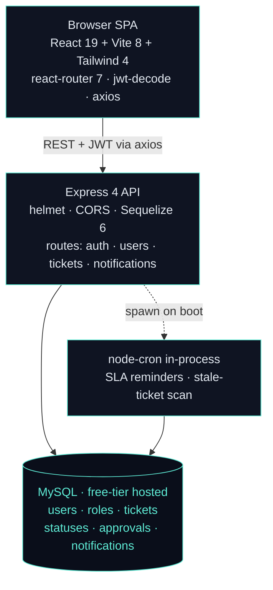
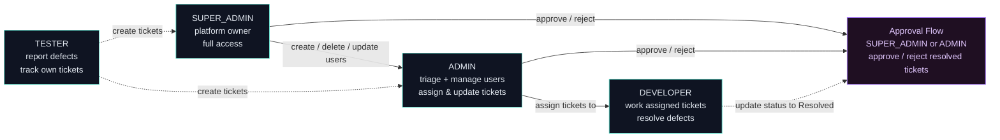
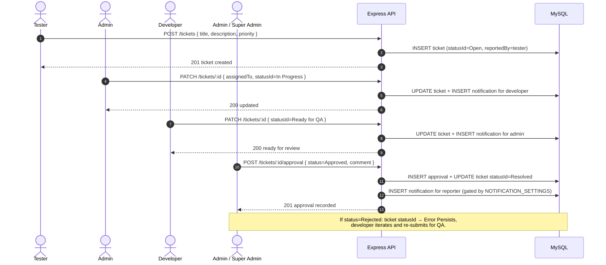
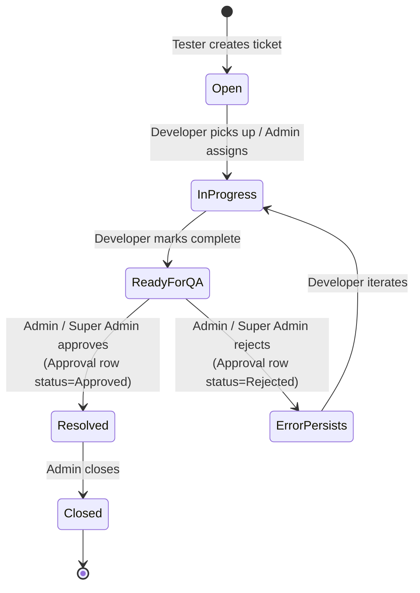
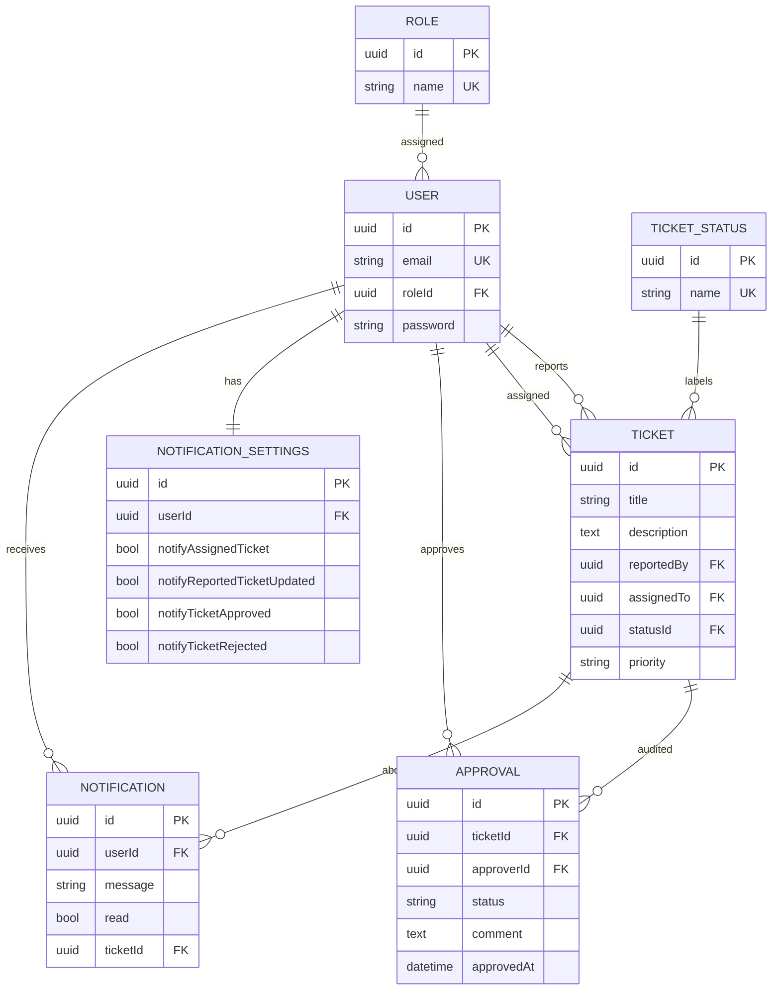

# Service Ticket System

> Internal IT/QA ticketing platform with a built-in approval workflow — testers report defects, developers fix them, admins triage, and approvers sign off before tickets close.

Service Ticket System is a **multi-tenant SaaS** ticketing platform: every organization gets its own isolated workspace of users, tickets, and notifications. Sign-up is a self-service **email-OTP** flow (register → verify code → set password), after which a user either **creates** a new organization (becoming its SuperAdmin) or **joins** an existing one via invite code. Inside each org, tester-reported defects flow through six lifecycle statuses with per-ticket approve/reject decisions and granular per-user notification preferences. The frontend is a React 19 SPA on Vercel; the backend is an **Express 4 app running on AWS Lambda** (exposed via a Lambda Function URL, no API Gateway), deployed by **GitHub Actions**, backed by **TiDB Cloud Serverless** (MySQL-compatible). The SLA housekeeping job runs on an **EventBridge** schedule that invokes the same Lambda.

---

## Live Demo

- **Live app:** https://service-ticket-system-frontend.vercel.app/login
- **Backend:** AWS Lambda (Function URL) — serverless REST API, deployed via GitHub Actions
- **Try it:** Log in with the seeded demo credentials (all in the **Demo Organization**, invite code `DEMO-CREW`) or register a brand-new account and create your own organization.

> The Lambda may "cold start" after a period of inactivity — the first request can take a couple of seconds while the container and DB connection warm up. Subsequent requests are fast.

### Demo accounts (Demo Organization)

| Role | Email | Password |
|------|-------|----------|
| SuperAdmin | `superadmin@test.com` | `Password123!` |
| Admin | `admin@test.com` | `Password123!` |
| Developer | `developer@test.com` | `Password123!` |
| Tester | `tester@test.com` | `Password123!` |

---

## Table of Contents

1. [What It Does](#what-it-does)
2. [Architecture](#architecture)
3. [Role Hierarchy & Permissions](#role-hierarchy--permissions)
4. [Ticket Lifecycle](#ticket-lifecycle)
5. [Tech Stack](#tech-stack)
6. [Database Design](#database-design)
7. [Repository Layout](#repository-layout)
8. [Repos](#repos)
9. [API Reference](#api-reference)
10. [Security](#security)
11. [Deployment & Environment Variables](#deployment--environment-variables)
12. [Cost Breakdown](#cost-breakdown)
13. [Local Development](#local-development)
14. [Author](#author)

---

## What It Does

- **Four-role access control** — `SUPER_ADMIN`, `ADMIN`, `TESTER`, `DEVELOPER`, each with distinct capabilities enforced server-side by `permissions.middleware.ts`.
- **Six ticket statuses** — `Open → In Progress → Ready for QA → Resolved / Error Persists → Closed`. Tester reports a defect; developer moves it through the workflow; admin/SuperAdmin approves (→ `Resolved`) or rejects (→ `Error Persists` for rework); admin eventually closes the ticket.
- **Per-ticket approval audit** — every approve/reject decision is a separate `APPROVAL` row with approver id, status, comment, and timestamp. Multiple decisions over a ticket's lifetime are preserved — full audit trail.
- **Notification preferences** — every user has a 1:1 `NOTIFICATION_SETTINGS` row (auto-created on user creation, defaults all true) covering assigned-ticket, ticket-updated, approved, and rejected events.
- **In-process SLA cron** — `node-cron` fires inside the same Express process; no separate worker service. Scans for stale/overdue tickets and emits notifications on schedule.
- **Auto-seed on boot** — on startup, the server idempotently seeds roles + ticket statuses + demo users (gated by `SEED_ON_BOOT` env var). No manual migration step for fresh deploys.
- **CORS allow-list** — hardcoded to the Vercel frontend URL and localhost dev origins; overridable via `CORS_ORIGINS` env for custom deployments.
- **Rate limiting** — `globalLimiter` on all routes, `loginLimiter` tightened on `/auth`.
- **Health probe** — `GET /health` returns `{ status: "UP", service, timestamp }` — used by Render uptime checks and the System Pulse companion project.
- **Profile self-service** — users change their own password from the Profile page.

---

## Architecture


```mermaid
graph TB
    Browser["Browser SPA<br/>React 19 + Vite 8 + Tailwind 4<br/>react-router 7 · jwt-decode · axios"]
    Express["Express 4 API<br/>helmet · CORS · Sequelize 6<br/>routes: auth · users · tickets · notifications"]
    Cron["node-cron in-process<br/>SLA reminders · stale-ticket scan"]
    MySQL[("MySQL · free-tier hosted<br/>users · roles · tickets<br/>statuses · approvals · notifications")]

    Browser -->|REST + JWT via axios| Express
    Express --> MySQL
    Express -.spawn on boot.-> Cron
    Cron --> MySQL

    classDef edge fill:#0f1422,stroke:#5eead4,color:#e2e8f0
    classDef store fill:#0a0e1a,stroke:#5eead4,color:#5eead4
    class Browser,Express,Cron edge
    class MySQL store
```

### Notable architectural choices

- **Single Express process, no queue.** `helmet + cors + express.json + rate-limit → connectDB() → defineAssociations() → auto-seed → initCronJobs() → listen`. Everything boots in one process on Render's free tier.
- **node-cron co-located with the API** saves an entire worker service. The trade-off is that horizontal scaling requires leader-election; at portfolio scale (single dyno) it is strictly better.
- **Modular DDD-ish layout** — each domain (`tickets`, `users`, `notifications`) has its own `controllers / services / repositories / dtos / models / routes`. No cross-module imports beyond the associations file.
- **Snake_case DB columns mapped to camelCase model attributes** via Sequelize `field:` — clean SQL audit trail, idiomatic TypeScript code.
- **Auto-seed on boot** (`SEED_ON_BOOT=true`) — idempotent role + status + demo user seeding runs every start, making fresh Render deploys zero-manual-step.
- **bcryptjs over bcrypt** — pure JS, no native build step; deploys cleanly to Render free tier and any serverless platform.

---

## Role Hierarchy & Permissions


```mermaid
flowchart LR
    super["SUPER_ADMIN<br/>platform owner<br/>full access"]
    admin["ADMIN<br/>triage + manage users<br/>assign & update tickets"]
    dev["DEVELOPER<br/>work assigned tickets<br/>resolve defects"]
    tester["TESTER<br/>report defects<br/>track own tickets"]
    approval["Approval Flow<br/>SUPER_ADMIN or ADMIN<br/>approve / reject resolved tickets"]

    super -->|create / delete / update users| admin
    super -->|approve / reject| approval
    admin -->|assign tickets to| dev
    admin -->|approve / reject| approval
    tester -.create tickets.-> super
    tester -.create tickets.-> admin
    dev -.update status to Resolved.-> approval

    classDef tier fill:#0f1422,stroke:#5eead4,color:#e2e8f0
    classDef flow fill:#1f0f22,stroke:#a978ff,color:#e2c8ff
    class super,admin,dev,tester tier
    class approval flow
```

| Role | Created by | Can create tickets | Can update tickets | Can approve/reject | Can manage users |
|------|------------|-------------------|-------------------|-------------------|-----------------|
| `SUPER_ADMIN` | Seed script | Yes | Yes (any) | Yes | Yes |
| `ADMIN` | SUPER_ADMIN | Yes | Yes (any) | Yes | Yes (non-super) |
| `DEVELOPER` | SUPER_ADMIN / ADMIN | No | Own assigned | No | No |
| `TESTER` | SUPER_ADMIN / ADMIN | Yes | Own reported | No | No |

Permissions are enforced by `permissions.middleware.ts` and `role.utils.ts` — every route declares its minimum required role or specific action guard.

---

## Ticket Lifecycle


```mermaid
sequenceDiagram
    autonumber
    actor Tester
    actor Admin
    actor Developer
    actor Approver as Admin / Super Admin
    participant API as Express API
    participant DB as MySQL

    Tester->>API: POST /tickets { title, description, priority }
    API->>DB: INSERT ticket (statusId=Open, reportedBy=tester)
    API-->>Tester: 201 ticket created

    Admin->>API: PATCH /tickets/:id { assignedTo, statusId=In Progress }
    API->>DB: UPDATE ticket + INSERT notification for developer
    API-->>Admin: 200 updated

    Developer->>API: PATCH /tickets/:id { statusId=Ready for QA }
    API->>DB: UPDATE ticket + INSERT notification for admin
    API-->>Developer: 200 ready for review

    Approver->>API: POST /tickets/:id/approval { status=Approved, comment }
    API->>DB: INSERT approval + UPDATE ticket statusId=Resolved
    API->>DB: INSERT notification for reporter (gated by NOTIFICATION_SETTINGS)
    API-->>Approver: 201 approval recorded

    Note over Approver,DB: If status=Rejected: ticket statusId → Error Persists,<br/>developer iterates and re-submits for QA.
```

### Status state machine


```mermaid
stateDiagram-v2
    [*] --> Open: Tester creates ticket
    Open --> InProgress: Developer picks up / Admin assigns
    InProgress --> ReadyForQA: Developer marks complete
    ReadyForQA --> Resolved: Admin / Super Admin approves<br/>(Approval row status=Approved)
    ReadyForQA --> ErrorPersists: Admin / Super Admin rejects<br/>(Approval row status=Rejected)
    ErrorPersists --> InProgress: Developer iterates
    Resolved --> Closed: Admin closes
    Closed --> [*]
```

> Note: `Approved` and `Rejected` are values on the `APPROVAL` row, not ticket statuses. The ticket itself transitions to `Resolved` (on approve) or `Error Persists` (on reject) — see `src/modules/tickets/services/approval.service.ts`.

---

## Tech Stack

### Backend

| Layer | Technology | Why |
|-------|-----------|-----|
| Runtime | Node.js + TypeScript 5 | Typed, modern Node LTS |
| Framework | **Express 4** | Lightweight, broad ecosystem |
| ORM | **Sequelize 6** + mysql2 | Full-featured ORM, association DSL, migrations |
| Database | **MySQL** | Broader free-tier availability than Postgres |
| Auth | JWT (`jsonwebtoken`) | Stateless, no session store |
| Password | **bcryptjs** | Pure JS, no native build step |
| Validation | **Yup** | Schema-first, composable |
| Scheduler | **node-cron** | In-process cron; no extra service |
| Notifications | In-app only (DB rows) | `NOTIFICATION` and `NOTIFICATION_SETTINGS` tables — no email layer wired up |
| Security | helmet · cors · rate-limit | CORS allow-list, security headers, per-route limiters |
| Dev | nodemon · ts-node · typescript 5 | Hot reload, no build step in dev |

### Frontend

| Layer | Technology | Why |
|-------|-----------|-----|
| Framework | **React 19** + TypeScript 5 | Latest React, typed props |
| Build | **Vite 8** | Sub-second HMR, fast CI builds |
| Styling | **Tailwind CSS 4** | Utility-first, latest engine |
| Routing | react-router-dom 7 | Nested layouts, protected routes |
| HTTP | **axios** | Interceptors for JWT injection |
| Auth | jwt-decode | Token inspection client-side |
| Icons | lucide-react | Consistent icon set |
| Linting | ESLint 9 + typescript-eslint | Strict type-aware lint |
| Hosting | **Vercel** | Auto-deploy from main, global CDN, free SSL |

---

## Database Design

Seven Sequelize models with UUID v4 primary keys throughout. DB columns are snake_case; model attributes are camelCase, mapped via Sequelize `field:` — clean SQL audit trail, idiomatic JS code.


```mermaid
erDiagram
    ROLE ||--o{ USER : assigned
    TICKET_STATUS ||--o{ TICKET : labels
    USER ||--o{ TICKET : reports
    USER ||--o{ TICKET : assigned
    USER ||--o{ APPROVAL : approves
    TICKET ||--o{ APPROVAL : audited
    USER ||--|| NOTIFICATION_SETTINGS : has
    USER ||--o{ NOTIFICATION : receives
    TICKET ||--o{ NOTIFICATION : about

    ROLE {
        uuid id PK
        string name UK
    }
    USER {
        uuid id PK
        string email UK
        uuid roleId FK
        string password
    }
    TICKET_STATUS {
        uuid id PK
        string name UK
    }
    TICKET {
        uuid id PK
        string title
        text description
        uuid reportedBy FK
        uuid assignedTo FK
        uuid statusId FK
        string priority
    }
    APPROVAL {
        uuid id PK
        uuid ticketId FK
        uuid approverId FK
        string status
        text comment
        datetime approvedAt
    }
    NOTIFICATION {
        uuid id PK
        uuid userId FK
        string message
        bool read
        uuid ticketId FK
    }
    NOTIFICATION_SETTINGS {
        uuid id PK
        uuid userId FK
        bool notifyAssignedTicket
        bool notifyReportedTicketUpdated
        bool notifyTicketApproved
        bool notifyTicketRejected
    }
```

### Table details

#### `tickets`

| Column | Type | Notes |
|--------|------|-------|
| `id` | UUID (PK) | v4 |
| `title` | VARCHAR | |
| `description` | TEXT | |
| `reported_by` | UUID (FK → users.id) | |
| `assigned_to` | UUID (FK → users.id) | nullable |
| `status_id` | UUID (FK → ticket_statuses.id) | |
| `priority` | VARCHAR | `LOW / MEDIUM / HIGH / CRITICAL` |

#### `approvals`

Per-decision audit row — multiple approvals over a ticket's lifetime are preserved.

| Column | Type | Notes |
|--------|------|-------|
| `id` | UUID (PK) | |
| `ticket_id` | UUID (FK) | |
| `approver_id` | UUID (FK) | |
| `status` | ENUM | `Approved / Rejected` |
| `comment` | TEXT | becomes part of audit trail |

#### `notification_settings`

1:1 with users. Defaults all `true` — auto-created for new users.

| Column | Type |
|--------|------|
| `user_id` | UUID (FK) |
| `notify_assigned_ticket` | BOOLEAN |
| `notify_reported_ticket_updated` | BOOLEAN |
| `notify_ticket_approved` | BOOLEAN |
| `notify_ticket_rejected` | BOOLEAN |

**Notable design choices:**

- **UUID v4 everywhere** — no sequential IDs leaking row counts or enabling enumeration attacks.
- **`TICKET_STATUS` as a reference table** — statuses are seeded rows, not a VARCHAR enum. Adding a status is a row insert, not a schema change.
- **`APPROVAL` as an immutable audit log** — each approve/reject is a new row; the full history of decisions is always queryable.
- **`NOTIFICATION_SETTINGS` auto-created** on user insert by `notification-setting.service.ts` — users always have preferences; no null checks needed.

---

## Repository Layout

```
service-ticket-system/           ← this repo (backend)
├── package.json                 # Express 4, Sequelize 6, node-cron, bcryptjs, Yup
├── tsconfig.json
└── src/
    ├── server.ts                # Entry: boot → connectDB → defineAssociations → seed → cron → listen
    ├── associations/
    │   └── associations.ts      # All Sequelize hasMany / belongsTo wired here
    ├── config/
    │   ├── db.ts                # Sequelize instance + connectDB()
    │   ├── roles.ts             # Role name constants
    │   └── statuses.ts          # Ticket status name constants
    ├── middlewares/
    │   ├── auth.middleware.ts       # JWT verify → req.user
    │   ├── permissions.middleware.ts # Role + action guards
    │   ├── rate-limit.middleware.ts  # globalLimiter + loginLimiter
    │   ├── role.utils.ts            # hasRole, isAtLeast helpers
    │   ├── security-headers.middleware.ts
    │   └── validator.middleware.ts  # Yup schema runner
    ├── modules/
    │   ├── tickets/
    │   │   ├── controllers/     # create, list, get, update, approval, fetch-status
    │   │   ├── cron/
    │   │   │   └── ticket.cron.ts  # SLA reminders + stale-ticket scan
    │   │   ├── dtos/            # create-ticket, update-ticket, create-approval, response shapes
    │   │   ├── models/          # Ticket, TicketStatus, Approval (Sequelize models)
    │   │   ├── repositories/    # ticket, ticket-status, approval
    │   │   ├── routes/
    │   │   │   └── ticket.routes.ts
    │   │   └── services/
    │   │       ├── ticket.service.ts    # Full CRUD + status transitions + notifications
    │   │       └── approval.service.ts  # Approve/reject logic + audit row
    │   ├── users/
    │   │   ├── controllers/     # auth, login, create, list, get, update, delete,
    │   │   │                    # notification settings (get + update), fetch-role
    │   │   ├── dtos/
    │   │   ├── models/          # User, Role, NotificationSettings
    │   │   ├── repositories/    # user, role, notification-setting
    │   │   ├── routes/          # auth.routes, user.routes, notification-settings.routes
    │   │   └── services/        # auth, user, notification-setting
    │   └── notifications/
    │       ├── controllers/     # list-notifications
    │       ├── dtos/
    │       ├── models/          # Notification
    │       ├── repositories/    # notification
    │       ├── routes/
    │       └── services/        # notification.service
    ├── scripts/
    │   ├── seed-roles.ts        # Idempotent role seeding
    │   ├── seed-ticket-status.ts
    │   ├── seed-users.ts        # Demo accounts for all four roles
    │   └── sync-db.ts           # Sequelize sync (force: false)
    └── utils/
        ├── notification.validation.ts
        ├── ticket.validation.ts
        └── user.validation.ts

service-ticket-system-frontend/  ← companion repo (see Repos section)
```

---

## Repos

| Repo | Stack | Link |
|------|-------|------|
| **service-ticket-system** (this repo) | REST API · Express 4 + Sequelize + MySQL + node-cron | https://github.com/Asciente-rks/service-ticket-system |
| **service-ticket-system-frontend** | Web SPA · React 19 + Vite 8 + Tailwind 4 | https://github.com/Asciente-rks/service-ticket-system-frontend |

The frontend is a separate repo deployed independently to Vercel. It consumes this API via `axios` with a `VITE_API_URL` env var pointing at the Render service URL.

---

## API Reference

### Auth & Onboarding

| Method | Path | Auth | Purpose |
|--------|------|------|---------|
| POST | `/auth/register` | none | Start sign-up: `{ email }` → sends a 6-digit OTP |
| POST | `/auth/verify-otp` | none | `{ email, code }` → returns a short-lived `registrationToken` |
| POST | `/auth/set-password` | none | `{ registrationToken, name, password }` → creates the account, returns JWT |
| POST | `/auth/login` | none | Email + password → JWT |
| GET | `/auth/me` | session | Current user profile (id, name, email, roleId, organizationId) |

> The JWT encodes `organizationId`. A freshly-registered user has `organizationId: null` and must create or join an org before accessing tenant data.

### Organizations

| Method | Path | Auth | Purpose |
|--------|------|------|---------|
| POST | `/organizations` | session | Create an org `{ name }`; caller becomes its SuperAdmin. Returns a re-issued JWT. |
| POST | `/organizations/join` | session | Join via `{ inviteCode }`; caller joins as Tester. Returns a re-issued JWT. |
| GET | `/organizations/me` | session + org | Current org (name, slug, memberCount; invite code shown to admins) |

### Users

| Method | Path | Auth | Purpose |
|--------|------|------|---------|
| GET | `/users` | session + role check (ADMIN / DEVELOPER / TESTER) | List users |
| GET | `/users/:id` | session + owner-or-admin | Get a single user |
| POST | `/users` | session + admin | Create user with role assignment |
| PUT | `/users/:id` | session + owner-or-admin + role-hierarchy check | Update user details |
| DELETE | `/users/:id` | session + owner-or-admin + role-hierarchy check | Hard delete user |
| GET | `/users/roles` | none | List all roles (lookup table) |
| GET | `/users/notification-settings` | session | Get the **current user's** notification preferences |
| PATCH | `/users/notification-settings` | session | Update the current user's notification preferences |

### Tickets

| Method | Path | Auth | Purpose |
|--------|------|------|---------|
| GET | `/tickets/statuses` | none | List all ticket statuses (no auth — reference data) |
| GET | `/tickets` | session | List tickets (role-filtered server-side) |
| GET | `/tickets/:id` | session | Ticket detail |
| POST | `/tickets` | session + org + role check (SUPER_ADMIN / ADMIN / TESTER) | Create a ticket |
| PATCH | `/tickets/:id` | session + org | Update status, assignee, details (deeper checks live in the service layer) |
| DELETE | `/tickets/:id` | session + org (admin or reporter) | Delete a ticket within the caller's org |
| POST | `/tickets/:id/approval` | session + org + role check (SUPER_ADMIN / ADMIN) | Approve (→ Resolved) or reject (→ Error Persists) a Ready-for-QA ticket |

> All ticket reads/writes are scoped to the caller's `organizationId` — one org can never see or modify another's tickets.

### Notifications

| Method | Path | Auth | Purpose |
|--------|------|------|---------|
| GET | `/notifications` | session + org | List notifications for the current user |
| GET | `/notifications/unread-count` | session + org | `{ count }` of unread notifications (drives the header badge) |
| PATCH | `/notifications/:id/read` | session + org | Mark a single notification read |
| PATCH | `/notifications/read-all` | session + org | Mark all of the user's notifications read |

---

## Security

| Layer | Defense |
|-------|---------|
| Password storage | bcryptjs hash + compare |
| JWT | Short-lived signed tokens; verified on every protected route by `auth.middleware.ts` |
| Rate limiting | `globalLimiter` on all routes; `loginLimiter` (tighter) on `/auth` |
| CORS | Explicit allow-list: Vercel frontend URL + localhost dev origins; overridable via env |
| Security headers | helmet (CSP disabled for SPA flexibility, CORP set to `cross-origin`) + custom `security-headers.middleware.ts` |
| Input validation | Yup schemas in `utils/*.validation.ts`, run by `validator.middleware.ts` before controllers |
| Role enforcement | `permissions.middleware.ts` checks `req.user.role` against declared minimum per route |
| UUID PKs | No sequential IDs — prevents row-count leakage and enumeration |
| Body size cap | `express.json({ limit: "1mb" })` |

---

## Deployment & Environment Variables

The backend runs on **AWS Lambda** behind a **Lambda Function URL** (no API Gateway, so no per-request gateway cost). CI/CD is **GitHub Actions** (`.github/workflows/deploy-backend.yml`): on every push to `main` it builds the TypeScript, packages a zip (`dist/` + production `node_modules`), and creates/updates the function, its Function URL (with CORS), and a daily EventBridge schedule for the SLA job — all via the AWS CLI.

### One-time setup

1. **Create an AWS IAM user** for CI with programmatic access and a policy covering `lambda:*`, `iam:CreateRole` / `iam:GetRole` / `iam:AttachRolePolicy` / `iam:PassRole`, `events:*`, and `sts:GetCallerIdentity` (least-privilege policy JSON is in the repo discussion / can be scoped to the specific role + function ARNs). If you'd rather not grant IAM-create, pre-create the execution role and pass its ARN as `LAMBDA_ROLE_ARN`.
2. **Add GitHub repository secrets** (Settings → Secrets and variables → Actions):

| Secret | Required | Purpose |
|--------|----------|---------|
| `AWS_ACCESS_KEY_ID` | ✅ | CI IAM user access key |
| `AWS_SECRET_ACCESS_KEY` | ✅ | CI IAM user secret |
| `AWS_REGION` | ➖ | AWS region (default `us-east-1`) |
| `DB_HOST` `DB_PORT` `DB_NAME` `DB_USER` `DB_PASSWORD` | ✅ | TiDB Cloud connection |
| `JWT_SECRET` | ✅ | Long random string for signing JWTs |
| `CORS_ORIGINS` | ✅ | Comma-separated frontend origins (Express allow-list) |
| `EMAIL_USER` `EMAIL_PASS` | ➖ | Gmail address + 16-char App Password for OTP email (omit to use demo OTP mode) |
| `EXPOSE_OTP` | ➖ | `true` to return the OTP in the API response even with email set (demo) |
| `JWT_EXPIRES_IN` | ➖ | Session token lifetime (default `8h`) |
| `LAMBDA_FUNCTION_NAME` | ➖ | Override function name (default `service-ticket-system-api`) |
| `LAMBDA_ROLE_ARN` | ➖ | Use an existing execution role instead of auto-creating one |

3. **Push to `main`** (or run the *Deploy Backend to AWS Lambda* workflow). The workflow's summary prints the **Function URL** — use it as the frontend's `VITE_API_URL`.
4. **Run the *Database (migrate / seed)* workflow** (Actions tab → manual `workflow_dispatch`, `action: both`) once to create the new tables/columns and seed roles, statuses, and the Demo Organization.

### Runtime env vars (set automatically by the deploy workflow on the function)

| Variable | Value | Notes |
|----------|-------|-------|
| `NODE_ENV` | `production` | |
| `SKIP_DB_BOOTSTRAP` | `true` | Skips `CREATE DATABASE` on connect (managed DB) |
| `DB_SSL` | `true` | TLS to TiDB |
| `DB_*` / `JWT_SECRET` / `CORS_ORIGINS` / `EMAIL_USER` / `EMAIL_PASS` | from secrets | |

### Local development & DB scripts

```bash
npm run dev             # ts-node + nodemon on :3000 (in-process cron + auto-seed)
npm run build           # tsc -> dist/
npm run db:migrate      # idempotent additive schema migration (safe on live DB)
npm run seed:roles      # idempotent role rows
npm run seed:status     # idempotent ticket status rows
npm run seed:users      # Demo Organization + 4 demo accounts
npm run seed:all        # roles + statuses + users in sequence
```

> **Cron in Lambda:** `node-cron` cannot run in Lambda's event-driven model. The SLA stale-ticket job is exported as `runStaleTicketCheck()` and invoked by an EventBridge schedule (`cron(0 9 * * ? *)`) that sends the Lambda an event the handler detects (`{ "__cron": true }`). Locally, `initCronJobs()` still runs it in-process.

---

## Cost Breakdown

Designed for **$0/month** — every layer runs on a free tier with no expiry.

| Service | Free tier | We use | Headroom |
|---------|-----------|--------|----------|
| AWS Lambda + Function URL | 1M requests + 400k GB-s / mo (always-free) | A portfolio app's traffic | 99%+ |
| AWS EventBridge | 14M scheduled invocations / mo free | 1 invocation/day | ~100% |
| TiDB Cloud Serverless (MySQL) | 5 GB storage + generous RUs | < 50 MB | 99%+ |
| Vercel Hobby (frontend) | 100 GB bandwidth, unlimited deploys | < 500 MB/mo | 99.5% |
| GitHub Actions (public repo) | Unlimited minutes | CI/CD deploys | Unlimited |

**Monthly total: $0/month**

**Rationale for notable choices:**

- **Lambda Function URL over API Gateway** — Function URLs add no cost on top of Lambda's always-free tier; API Gateway bills per request after its 12-month free tier expires.
- **TiDB Cloud Serverless** — MySQL-compatible, generous always-free tier, and HTTPS/TLS access that suits Lambda's connection model (no VPC required).
- **bcryptjs / mysql2 / serverless-http** — all pure JS, no native build step, so the same zip runs on the Amazon Linux Lambda runtime.
- **EventBridge schedule over node-cron** — Lambda has no long-lived process; a scheduled event invokes the same function for the daily SLA job.

---

## Local Development

```bash
# 1. Clone and install
git clone https://github.com/Asciente-rks/service-ticket-system.git
cd service-ticket-system
npm install

# 2. Configure environment
cp .env.example .env        # fill in DB_* and JWT_SECRET

# 3. Sync schema + seed demo data
npm run db:reset            # sequelize sync + roles + statuses + demo users

# 4. Start dev server (ts-node + nodemon hot reload)
npm run dev                 # listens on :3000

# 5. Frontend (separate repo)
git clone https://github.com/Asciente-rks/service-ticket-system-frontend.git
cd service-ticket-system-frontend
npm install
# set VITE_API_URL=http://localhost:3000 in .env.local
npm run dev                 # Vite HMR at :5173
```

For a fresh local MySQL instance, set `DB_HOST=127.0.0.1`, create the database, and `npm run db:reset` will handle the rest.

---

## Author

**Ralph Kenneth Sonio** — Cloud-Native Backend & QA Engineer
[Portfolio](https://asciente-portfolio.vercel.app) · [GitHub](https://github.com/Asciente-rks)
